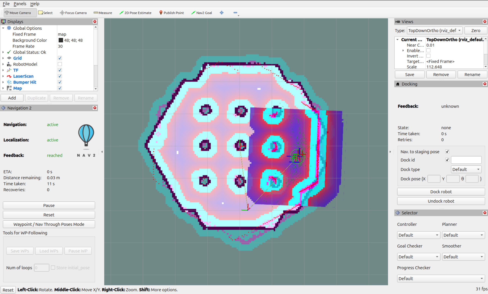
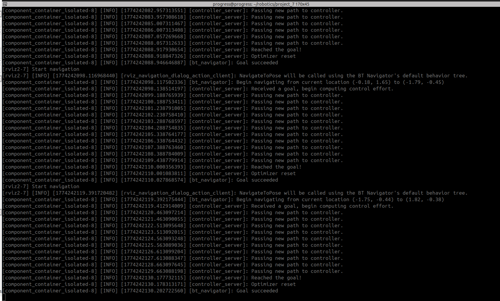
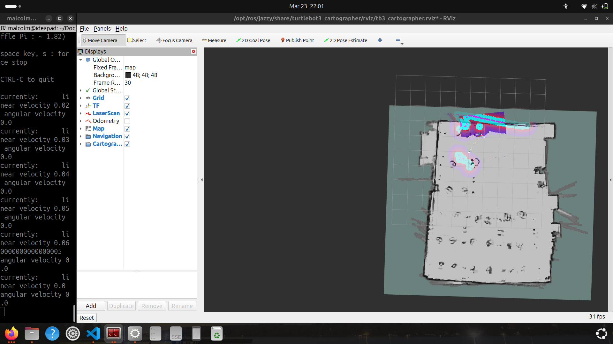
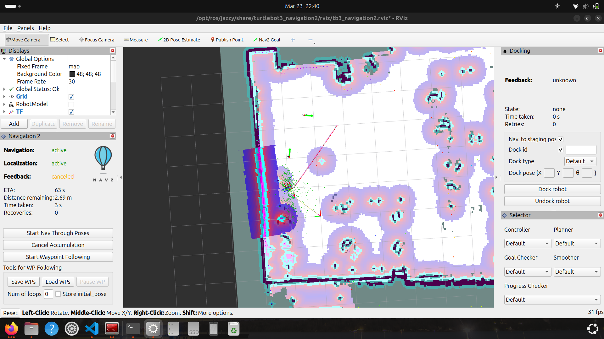
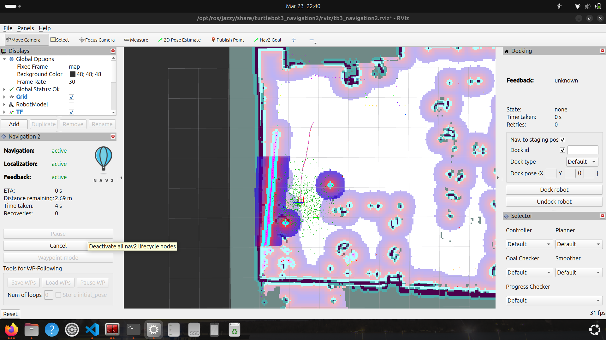
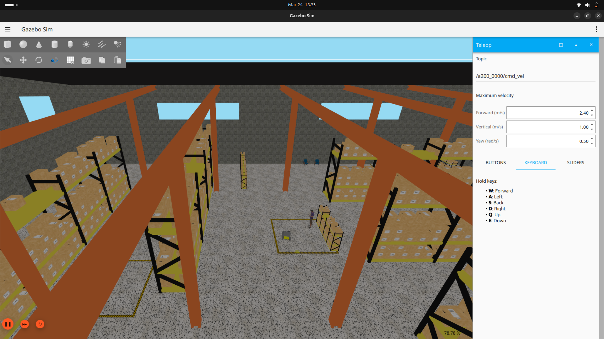
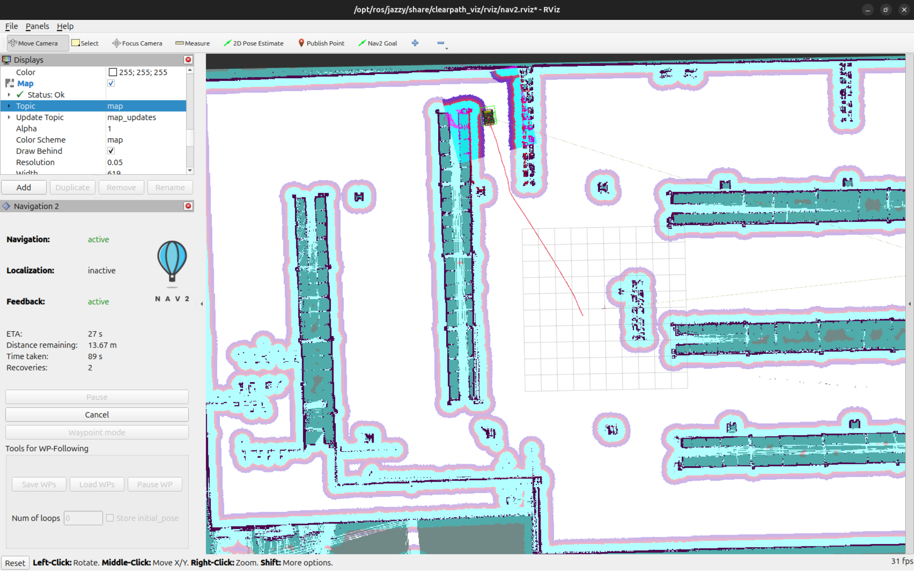
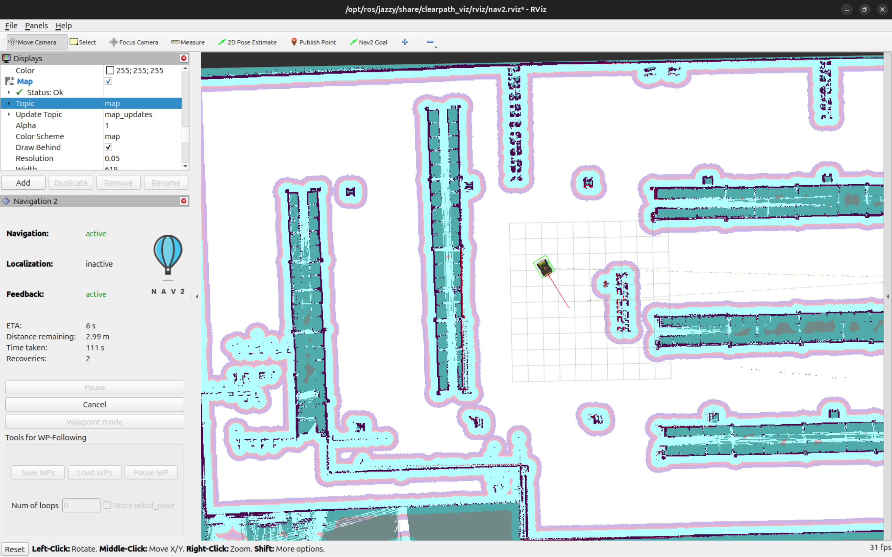

# Project 7, ROS2 Navigation Stack, Group 1
#### Progress Munoriarwa & Malcolm Benedict

## Introduction
This exercise covered the ROS2 Navigation stack, both in simulation and physical implementation. The work was completed in ROS2 Jazzy, running on Ubuntu 24.04 LTS. The steps needed to replicate this work are relatively straightforward; for the most part it follows the ROS2 and Clearpath tutorials directly. However it is worth mentioning that the map argument for Nav2 is quite particular with its syntax. The file path must be given as an absolute, symbols such as `~/` to represent the home directory do not work. This is quite atypical of command line arguments in a Linux environment. The root cause of this behavior is unknown.

## Part 1: Turtlebot Simulation

The first section served as an introduction to the ROS2 navigation stack, using a simulated Turtlebot in Rviz. Here, the map itself is completely certain; the uncertainty comes for the simulated sensor data. As can be seen in Fig. 1, the walls of the map are completely solid, all grid squares in the map are known, and there is no smearing in the features. This potentially allows the simulation to perform better than a real world implementation.

*Fig. 1: The Turtlebot simulated in Rviz2 with Nav2 active*

The color-coded costmaps can be seen near the Turtlebot. The absolute cost zones are seen in magenta, while the adjacent inscribed sones are in cyan. The purple and red zones represent free space, where the color temperature represents the proximity to the inscription threshold. Note that in Fig. 1, the costmap has become unaligned from the actual map. this may be the result of an localization error, or the result of a novel bug, which resulted in two completing transforms for the robot's current position being published.

*Fig. 2: Terminal window showing navigation goal output*

## Part 2: Real-world Turtlebot Mapping

Next, the Turtlebot was used to map the EERC 722 laboratory, by driving it around the perimeter of the room. Overall, the relative simplicity of the room allowed the SLAM node to make a relatively accurate map. However there were some complications. The chairs and work benches have a very small silhouette to the LiDAR, which limits the certainty of these grid squares. Additionally, the size of the room means that it takes a relatively long time to complete the map. This results in misalignment when the loop is closed, as can be seen in Fig. 3. This problem was exacerbated by high speeds and rapid turns; the first mapping run had to be discarded due to excessive ghosting. 

*Fig. 3: Turtlebot SLAM in EERC 722*

Unfortunately, during testing, there was some sort of bug, which prevented Nav2 goals from being set in the SLAM instance or Rviz2. To get around this, the map was saved and reopened in navagator. Form there, goals could be successfully set, as seen in Fig. 4.

*Fig. 4: The Turtlebot with multiple waypoints*

The performance of the navagator was suboptimal. While it plotted a good route to its target as seen in Fig. 5, in actual execution, it hugged the wall, eventually driving into it. This may be the result of a poor initial pose estimate, or some issue with the Turtlebot's ability to sense its orientation.

*Fig. 5: The Turtlebot navigating to a target*

## Part 3: Jackal Simulation

Lastly, the Clearpath Husky was simulated in a warehouse environment. This was originally intended to be performed with the Clearpath Jackal, however the Husky was used instead. This should not be a substantial issue, as they are both simulated with the same syntax and have similar kinematics.

*Fig. 6: The Husky simulated Gazebo*

The primary differance between the simulated Husky and Turtlebot was how the robots themselves are defined. ROS2 uses `.yaml` files to define the robots themselves. The Turtlebot tutorial loads the file automatically, whereas the Clearpath nodes require the user to define the `.yaml`, as well as the robot's model number when initializing the nodes. Additionally, the simulations themselves are much more computationally intense, resulting in poor simulation performance, relative to the Turtlebots.

*Fig. 7: The Husky navigating to a goal*

*Fig. 8: The Husky navigating to a goal*

